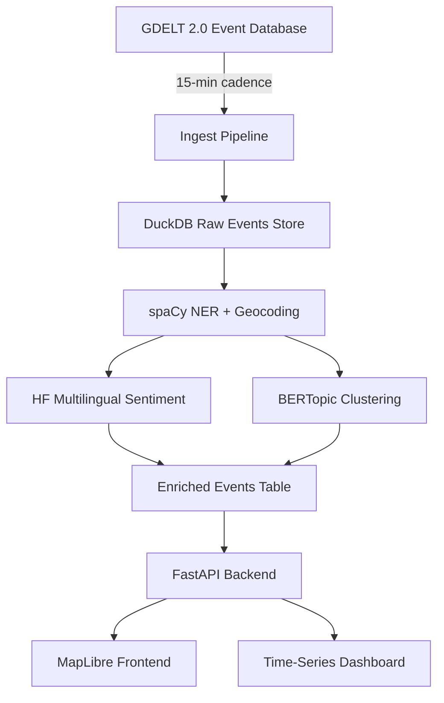

# Architecture

## Design goals

- Ingest at scale: handle 10K+ news events per day without manual intervention
- Reproducibility: every visualisation traceable back to source events with sentence-level provenance
- Multilingual from day one: sentiment and topic models that handle 8+ languages, not just English
- Deploy on a budget: free-tier APIs and serverless hosting only — no enterprise infrastructure assumptions
- Extensibility: same pipeline shape works for financial-news monitoring or AI-policy attention tracking

## System diagram

## Component breakdown

**Ingest pipeline.** Pulls from GDELT 2.0's English and translated event streams every 15 minutes. GDELT's GKG (Global Knowledge Graph) provides pre-extracted entities and themes, but we re-process for finer geocoding precision and to attach our own sentiment model.

**DuckDB raw store.** Chosen over PostgreSQL for analytical workloads on 10M+ event rows: zero infrastructure overhead, columnar storage, vectorised queries, and a single-file deployment that fits a free-tier serverless host. Schema is intentionally denormalised for read performance.

**spaCy NER + geocoding.** spaCy's `en_core_web_lg` for English; `xx_sent_ud_sm` plus language-specific NER models for non-English streams. Entity-to-coordinate resolution via Nominatim with an LRU cache to stay under rate limits.

**Multilingual sentiment.** `cardiffnlp/twitter-xlm-roberta-base-sentiment` as the base model — handles 8 languages out of the box and is small enough to run on free-tier inference. Optional fine-tune on a labelled news-sentiment subset if performance gaps are observed.

**Topic clustering.** BERTopic with sentence-transformers embeddings (`paraphrase-multilingual-MiniLM-L12-v2`), HDBSCAN clustering, c-TF-IDF for topic representation. Clusters are stable across daily ingest windows via incremental fitting.

**FastAPI backend.** REST + WebSocket endpoints. WebSocket layer pushes new event clusters to the frontend in near-real-time as ingest runs.

**Frontend.** MapLibre for the geographic view (open-source, no Mapbox dependency). Choropleth + bubble overlays for attention concentration and sentiment polarity respectively. Time-series view uses Plotly.

## Key design decisions

- **DuckDB over PostgreSQL.** Analytical workload with read-heavy access patterns and no concurrent-write needs from multiple services. DuckDB's single-file model also fits Vercel/Railway deploy constraints.
- **GDELT 2.0 over Reuters/AP direct.** GDELT aggregates from 200+ sources and is genuinely free; direct Reuters API access starts at $50K+/year. Trade-off: GDELT's processing latency averages 15 minutes, which is acceptable for the use case.
- **BERTopic over LDA.** Embedding-based topic models handle multilingual content far better than bag-of-words approaches, and BERTopic's incremental fitting matches our ingest cadence.
- **MapLibre over Mapbox.** Mapbox's free tier is generous but caps at 50K map loads/month. MapLibre is fully open-source with no usage caps.

## Open questions

- Cross-lingual topic deduplication: when the same story breaks in 6 languages simultaneously, current clustering treats them as separate topics. Investigating cross-lingual sentence embeddings to merge.
- Sentiment ground-truth for evaluation: no public multilingual news-sentiment benchmark exists at the scale we need. Considering crowdsourced annotation on a 1K-event holdout set.
- Geocoding ambiguity: "Cambridge" appears in events as Cambridge UK, Cambridge MA, and Cambridge ON with no easy disambiguation. Currently uses event co-mention context as a tie-breaker; precision is roughly 85%.